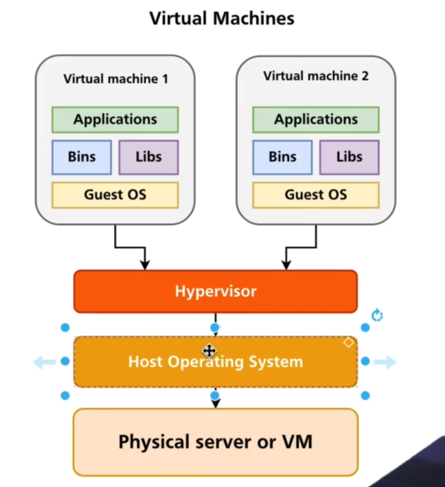
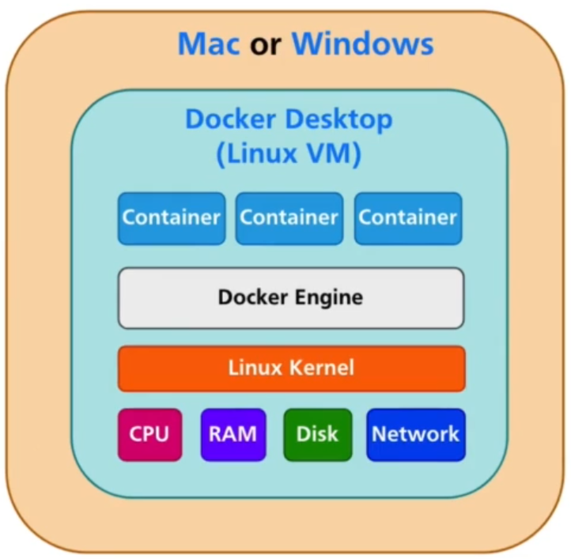
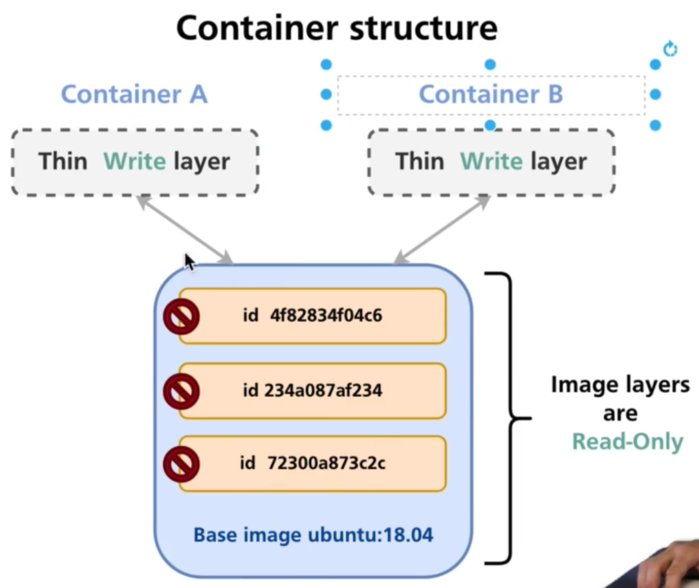

# Introduction

#### First container:
```
docker run hello-world
docker ps    # show running containers
docker images    # show docker images 
docker ps -a    # history of running containers
docker container ls -a    # do the same thing as previous command
docker run ubuntu    # run ubuntu but it stop immedately because there is no process running
docker run -it ubuntu    # run ubuntu and stay there to execute command
```
***When there is no process running inside of the container, docker will terminate the container.***

#### Busybox container:
```
docker run busybox    # this is simple and lightweight linux
```

#### Alpine container:
- alpine is a full feature linux distribution. Busybox included in this linux, that means if you type "busybox" you can see all the commands. For example we can run some commands like so:
```
docker pull alpine    # pull image from docker
busybox ifconfig
busybox traceroute google.com
busybox ping google.com
```
  
# Port and volume mapping  

#### Running Nginx:
```
docker pull nginx
docker run nginx
docker stop nginx 
```
***You can use "docker kill" command too which is better, because docker will use kill signal 10 sec after you use "docker stop" command.***  
***For using a container you are able to use image full name, ID or first two letter of ID.***  
- After we start the service, we need to map ports:
```
docker run -p 8080:80 nginx    # open external port, now we open port 8080 in our system and port 80 in container
```

#### Use custom content for Nginx:
```
docker run -p 8081:80 -v (folder_path_local):(folder_path_container) nginx    # this way we can map volume to this container
```  

#### Using path variable in volume mapping:
```
docker run -p 8081:80 -v $PWD:(folder_path_container) nginx
```    
***In windows we need to use ${PWD}.***  
***Make sure that you are in the right directory when you use PWD variable.***

# Container Management

#### Running containers in background:
```
docker history (container_name)    # we can see the history of container execution
docker run -p 5555:80 --name (container_name)
docker run -p 8080:80 -d nginx    # run container in background (detached mode)
docker logs (container_ID)    # check container logs
```

#### Running container with Pseudo TTY:
```
docker run -i alpine
docker run -t alpine
docker run -it alpine
```
- When we use "-i" option, you can execute command but there is no color and terminal options. For exit, we should use "exit" command.  
When we use "-t" option, you will be able to execute command but there will be no ouput. For exit, we need to stop the container from another terminal.

#### Creating multiple container from same image:  
- Just do it!

#### Cleaning up:
- With "docker ps -a" command we can see that containers are stopped, we can start them again or remove them.
```
docker start (container_name_ID)
docker rm (container_name)
docker container rm (some_container_IDs)
docker --help
docker container --help
docker container prune    # this command will remove all stopped containers
```

# Running an application

#### Create python container:
```
docker pull python
docker run -it python
```

#### Simple python program:
```
docker run -it -v $PWD:(python_file_path) python python3 (python_file_path_in_container)
```
***We can use "-w" option to specified directory. (working directory inside the container)***

#### Create node.js container:
```
docker pull node
docker run -it node
```

#### Simple node.js program:
```
docker run -v $PWD:(node.js_file_path) -w (working_directory) node node (node.js_file)
```

#### Express web server using node.js:
1. docker ... npm init
2. docker ... npm install express
3. add docker port mapping

***Docker containers are capable of create and modify external files in local computer.***

# Running mongoDB containers

#### Create mongo image:
```
docker pull mongo
docker run mongo
docker exec -it (container_ID) bash    # execute command in container
docker exec -it (container_ID) sh
```

#### What is entrypoint:
- "docker-entrypoint.sh" is a script which mongoDB has been started with it. This script is located in "/usr/local/bin". If you open the script you can see it's start "mongod" command that we can change it.
```
docker inspect (container_ID)    # show all detail about container
```

#### Create new mongoDB:
```
docker exec -it (container_ID) mongo    # enter mongo shell, now we can execute db commands
```

#### Running mongoDB container with persistent DB:
- With command below we can map local folder to container folder, this way we can use same db in diffrent containers.
```
docker run -d -v $PWD(local_folder):(container_db_folder) mongo 
```

# Communication between containers

#### Wordpress container
```
docker run wordpress
docker run -d -p 8080:80 wordpress
```
- Now we need a database to connected to this wordpress. Because in docker
  every container needs to do single task.

#### Network between containers
- Docker private network "172.17.0.0/16". Everytime we create a container one this IP is assigned to it, so we can ping IP with any port we want. This connection is bridge, so we can ping internet too.
```
docker inspect (container_ID)    # we can check IP with this command
```

#### Enviroment variable
```
docker exec (container_ID) env    # check container enviroment variable
```
- You can check enviroment variable by login into the os and use "env" command
  too, which will show more option because you using bash.

#### Connect two container
```
docker run mysql
docker run phpmyadmin/phpmyadmin
```
- After we pull the image, we need to set some enviroment variable.
```
docker run -e MYSQL_ROOT_PASSWORD=my_password mysql
docker run -p 8080:80 -e PMA_HOST=172.17.0.2 phpmyadmin/phpmyadmin
```
- Now we can connect to the server.  
***We can search about images in "hub.docker.com" website.***
- Becuase everytime container stop/start the IP will change, so it's prefered
  to use hostname.

# Default and custom network

#### Set hostname
```
docker run -it --name busybox1 -h busybox-one busybox
```
- With this command we can set name and hostname on container, but we can't
  ping a container using hostname in default bridge network.

#### Custom network
```
docker network --help
docker network ls    # list exist network
docker network inspect bridge    # detail about bridge network
```
- Now we will create custom network:
```
docker network create (network_name)
docker network inspect (network_name)
```
***Gateway network is assigned to docker host.***

- Let's create some containers with costum network:
```
docker run -it --network (network_name) busybox
```
***- Now we can communicate using hostname and name. Docker dns is handling this
part.***  
***- You won't see docker interface if you install it on mac and windows but you
can see it on linux.***  
***- We can choose specific version by this command, "docker run mysql:5.7"***  
***- If you don't map volume to your containers, your data will wipe as soon as
you stop the container.***

# Additional containers

#### Image with curl command
```
docker pull appropriate/curl
docker run -it appropriate/curl (website_url)    # execute curl command directly
docker run -it appropriate/curl sh
```

#### ElasticSearch container
```
docker pull elasticsearch:7.6.2
```
***Sometimes "latest" is not exist, so we should use version number.***

#### Insert document info elasticSearch
- We can use "curl container" and "elasticSearch container" to do that.

#### Redis container
```
docker pull redis
docker exec -it (container_ID) redis-cli    # enter redis cli
```
- We can manage redis sever with "rediscommander/redis-commander" container by
  GUI.
```
docker pull rediscommander/redis-commander
```

#### HTTPD container
```
docker pull httpd
docker run -p 8080:80 -d httpd
```

# Virtual machine vs Docker container
- Main diffrent between vm and container is, containers don't have os and
  separate resources, so they use host os and share ram and cpu between eachother.

#### VM architecture


#### Container architecture


# Docker on diffrent operation systems

#### Docker on linux


#### Docker on windows and mac


#### Container processes

- Docker use "containerd" and "runc" processes to handle container processes. It also use "namespaces" to separate users and hard drive.
- Containers don't have any limit to use host resources so when you install
  docker engine directly on linux machine it will use all resouces, but if you
  install docker desktop which is available on windows and mac os you can limit
  resources and on linux we can use "cgroups" to limit container resources.
- We can run container with 3 or more process like httpd, python ... but it's
  make managing harder, so it's better to use one process for each container
  which is called "single-purpose container".

# Docker components

#### Docker client
- Every tool we use to connect to docker server like terminal is "docker client". When we use "docker" command in terminal it will execute docker client from "/usr/local/bin/docker" in host system. Basically docker client just send some command to docker server and show us output.
```
docker version    # details about docker client and sever
```

#### Docker server
- Docker server is set of diffrent processes, like docker daemon, runc, containerd ...

#### Docker host
- Where we install docker is "docker host", so if you install docker on linux,
  your docker host is "linux". This means docker host helps docker server to
  run processes.
- When we install dokcer on windows and mac it will install on small linux on
  these operation systems, so you won't see "docker0" interface but technically
  your docker host is still linux and there is command which you can access to
  this small linux.

#### Docker image
- Docker image is read-only files which we can create containers from it.
- We can create our custom images from other images.

#### Docker container
- We can create multiple containers from a same image, so now we have a
  container with "writable layer" which we can modify everything we want in it.

#### Docker repository
- The directory all images with diffrent version are stored is called "docker
  repository".

#### Docker registry
- All docker repositories are stored in "docker registry", like docker hub
  website, so basically docker hub is a registry service.

#### Docker components overview


# Docker images and containers

#### Docker commands vs Management commands
- Docker commands:
    - Commands
    - Management:
        - This type of commands required additional arguments. For example
          "docker container".
```
docker (command) --help
```

#### Alternative commands


#### Basic container and images commands


```
docker image prune -a    # delete all images which don't associated any container to it
```
***Dangling images are images without tags. For example when you pull image
from docker hub and it's in your local cache but it doesn't exist in docker hub
anymore.***  
***Every image has multiple filesystem layers, because of that everytime you
delete a image, you will see multiple things are deleted.***

#### What is docker image


#### What is CMD in the docker

- CMD tells to image what to do when it's start.
```
docker inspect (container_ID)    # show CMD
```

#### What is container



#### Summary of images and containers
- Docker images are read-only and cosist of multiple fs layers. Fs layer could be reused by different images.
- Docker creates thin writable fs layer when new container is created based on
  the specific image and docker also starts new processes based on the CMD
  instructions located in the image.
- As soon as all processes in the container are stopped, docker stops container
  as well.
- Containers share resources of the docker host such as RAM, CPU, Hard drive
  and network and requests to the resources are made via common linux kernel.

# DockerFiles and docker compose

#### Create docker file
- Create "Dockerfile" for python:
```
FROM python:3.9
WORKDIR /app    # working directory
EXPOSE 5050    # port number
COPY Pipfile Pipfile.lock ./    # source, destination
RUN pip install pipenv    # run command inside image
RUN pipenv lock --requirements > requirements.txt
RUN pip install -r requirements.txt
COPY . ./    # copy file for next builds
CMD ["python", "main.py"]    # image will run with this command
```

#### Build image from Dockerfile
```
docker build (Dockerfile directory) -t (repository_name:tag)
```
